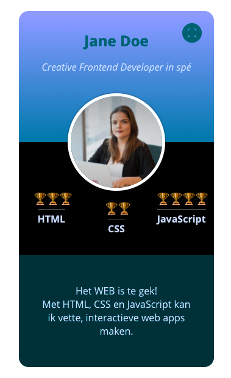

<link rel="stylesheet" href="https://tasks.fdnd.nl/global.css">

# Visitekaartje Experiment
Je hebt een eerste versie van je visitekaartje gemaakt waar je tevreden over bent, dus nu is er ruimte om te experimenteren met toffe CSS features. Maak jij een 3D versie van je visitekaartje? Of regel je een dark-mode theme met blend modes? Duik je in een van de nieuwe browser API's en waag je je naast CSS aan JavaScript? Bij deze leertaak mag je out-of-the-box denken!

## Context

Leertaak: Experimenteer met CSS features

Deze leertaak hoort bij sprint 1 "Your Tribe". Dit is een _experiment_ taak.

## Briefing
Ondertussen heb je als het goed is basis van de [duplicate leertaak](https://github.com/fdnd-task/fdnd-net-presence-duplicate) een eerste versie van je visitekaartje gemaakt. Bij deze leertaak doorloop je alle stappen van de development-lifecycle met als resultaat een experimentele versie van jouw visitekaartje, gepubliceerd via Github pages. 

Het Web is constant in beweging en dat geldt ook voor de ontwikkeling van CSS. Experimenteren met nieuwe features (of je verdiepen in reeds bestaande features) is een belangrijke competentie van een Frontender!

## Doel van deze leertaak
*Wat leer je in deze taak*

* Experimenteren met (nieuwe) CSS features
* De (on)mogelijkheden van CSS beter leren kennen

## Werkwijze
*De werkwijze volgt de fasering van de Development Life Cycle.*

Volg onderstaand stappenplan binnen de [**development-lifecycle**]() _[nog linken]_ om jouw visitekaartje gestructureerd te herontwerpen, aan te passen en op Github te publiceren.

Deze opdracht gaat over alle fases van de DLC [analyseren](#analyseren), [ontwerpen](#ontwerpen), [bouwen](#bouwen), [integreren](#integreren) en [testen](#testen).

### Analyseren
*In de analysefase inventariseer je wat er moet gebeuren om een taak uit te voeren en formuleer je een aantal uitgangspunten waar je ontwerp aan moet voldoen.* 

Aanpak

Voor het uitvoeren van deze taak nemen we een aantal stappen, we gaan:
1. een aantal ontwerpbeslissingen nemen op basis van de uitleg
2. die beslissingen inbouwen in het bestaande visitekaartje
3. jouw visitekaartje publiceren via Github pages
4. het visitekaartje testen op klasgenoten
5. het proces documenteren in de [README.md](../README.md)

### Ontwerpen
*In de ontwerpfase neem je ontwerpbeslissingen en zorg je dat je precies weet wat je moet gaan bouwen.*

In de ontwerpfase maak je meerdere ontwerpen (divergeren) en neem je vervolgens beslissingen (convergeren) op basis van de door jou geformuleerde uitgangspunten. Je zorgt je dat je precies weet wat je moet gaan bouwen.

Aanpak

1. In de workshop *Trucjes met CSS 1* heb je een aantal inspirerende voorbeelden gezien van wat mogelijk is met CSS. Ontwerp een nieuwe versie van je visitekaartje en probeer hierbij, net als bij de voorbeelden is gedaan, out-of-the-box te denken. 

2.  Pak een A4 en maak een aantal schetsen aan de hand van het template. 

3. Na bovenstaande stappen zorgvuldig doorlopen te hebben weet je ongeveer wat je gaat bouwen. Je kunt nu goed voorbereid door naar de volgende fase.

4. Fork deze repository en documenteer je bevindingen in de README.md

#### Materiaal

Hieronder staan de in de workshop getoonde voorbeelden voor als je nog even rustig wil kijken. Je kan natuurlijk ook zelf zoeken naar inspirerende voorbeelden; google bijvoorbeeld op *'Cool CSS tricks 2021'*...

- [CSS Text Effects](https://freefrontend.com/css-text-effects/)
- [Card Stack Effects](https://tympanus.net/codrops/2015/10/28/effect-ideas-for-card-stacks/)
- [Creative Link Effects](https://tympanus.net/codrops/2013/08/06/creative-link-effects/)

### Bouwen
*In de bouwfase realiseer je de beslissingen uit de ontwerpfase.*

Aanpak

Heb je een mooi ontwerp gemaakt van jou visitekaartje op basis van een van de inspirerende voorbeelden? Onderzoek hoe het voorbeeld is gemaakt door het lezen van de tutorial als dat er bij zit, of als er geen tutorial is door gebruik te maken van de *DevTools* van je browser. 

Heb je zelf iets ontworpen en kan je niet terugvallen op een voorbeeld, dan zal je zelf moeten bedenken/uitzoeken hoe je dat met CSS kan bouwen. Met de in de workshop behandelde CSS features en onderstaande bronnen kan je al een heel eind komen! 

Werk in de geforkte repository van deze leertaak. Als je aanpassingen hebt gedaan waar je tevreden over bent, kan je het comitten en pushen naar GitHub. 

#### Materiaal

- [MDN Styling Text](https://developer.mozilla.org/en-US/docs/Learn/CSS/Styling_text/Fundamentals)
- [MDN Background](https://developer.mozilla.org/en-US/docs/Web/CSS/background)
- [MDN Box Model](https://developer.mozilla.org/en-US/docs/Web/CSS/CSS_Box_Model)
- [MDN Position](https://developer.mozilla.org/en-US/docs/Web/CSS/position)
- [Transform, Transition & Animation](https://dev.to/moreno8423/css-transforms-transitions-and-animations-2m7d)

### Integreren
*In de integratiefase voer je de aanpassingen door zodat iedereen ze kan zien.*

Je gaat jouw aanpassing op het visitekaartje publiceren op internet! 

Aanpak

1. Doorloop hierbij dezelfde stappen als bij de duplicate leertaak.
2. Als het goed is gegaan kan je binnen enkele momenten jouw visitekaartje bekijken via de URL: [https://username.github.io/fdnd-visitekaartje-experiment/](https://username.github.io/fdnd-visitekaartje-experiment/).
3. Bekijk jouw visitekaartje even uitgebreid, ga daarna verder met de volgende fase.

#### Materiaal

- [duplicate leertaak](https://github.com/fdnd-task/fdnd-net-presence-duplicate)

### Testen
*In de testfase controleer je of jouw aanpassingen werken zoals bedoeld.*

Laat jouw visitekaartje testen door een paar klasgenoten en jouw docent. Noteer wat ze er van vinden. Ben je tevreden met het resultaat? Zo niet herhaal dan bovenstaande stappen.

Aanpak

1. Laat jouw visitekaartje aan iedereen zien
2. Noteer feedback
3. Ga terug naar de analysefase voor een volgende ronde verbeteringen

## Criteria
*Definitions of done*

Je bent klaar als je jouw proces (ontwerpbeslissingen, schetsen, inzichten en testresultaten) hebt gedocumenteerd in de [README.md](../README.md) in jouw *fork* van deze repository. Ook moet jouw visitekaartje bereikbaar zijn via gh-pages.

